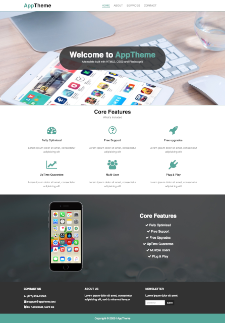
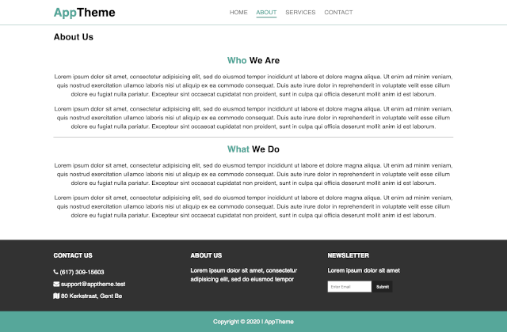
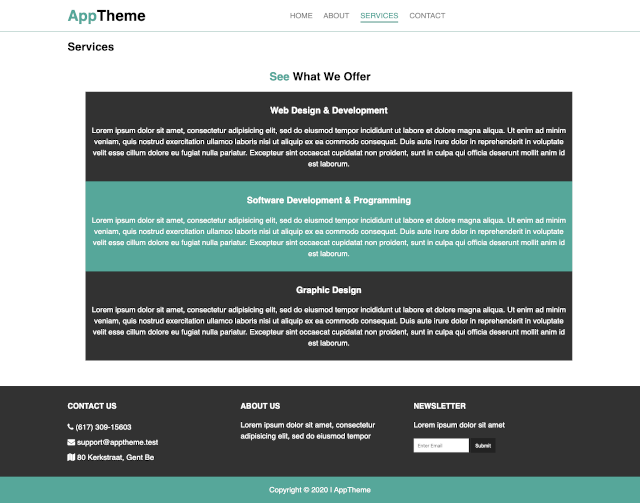
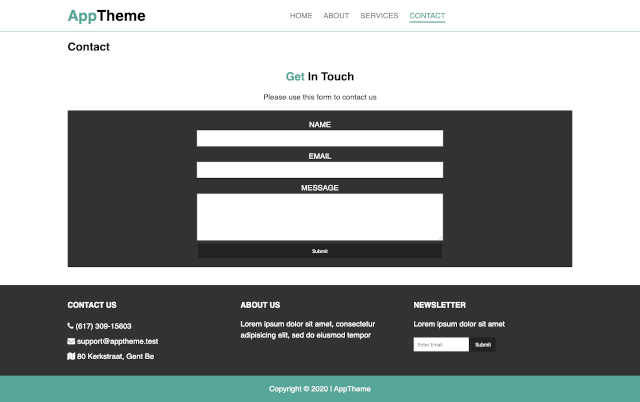

app-theme
## General Info.

This project was made using the Visual Studio Core for writing the code, and then I use GitKraken for save my code remotely in Github.

Layout: I combine Flexboxgrid and CSS for have more efficient layouts, and works better for the development workflow.

For be more organized I create different branches that show every step and change that I made.

Everything was building in a really friendly web page, that everyone can understand and use.

## Screenshots

## Technologies
* HTML5
* CSS3

## Setup
Clone or fork this repository!!!

## Features

* Home,About,Services, Contact page.
* Flexgridbox CSS.

## Status
Project is finished.

## Inspiration
 Project inspired by [this live demo](https://www.youtube.com/watch?v=qlA7dputiNc)

## Contact
Created by [@Elisa0045](https://github.com/Elisa0045) - feel free to contact me!